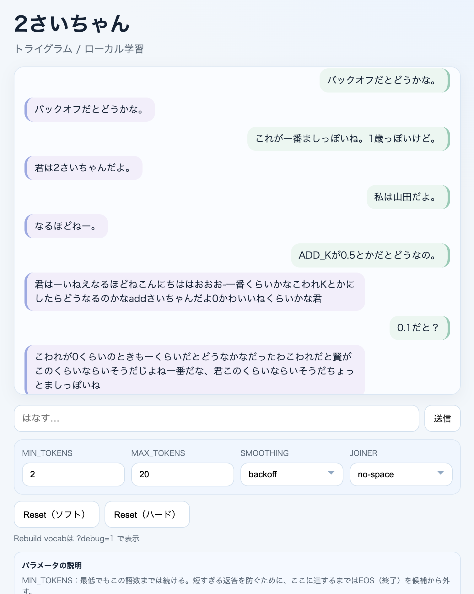

# 2さいちゃん（Nisai-chan）

**ローカルで動く、学習する超ミニLM**（言語モデル）です。  
目的は「LMの仕組みを0から理解する」こと。性能ではなく“動く教材”を目指しています。

今の中身は **単語トライグラム（統計的LM）＋Backoff**。  
ニューラルではなく、**カウントを足すだけ**の超シンプル版です。

---

## これは何をしているの？（超ざっくり）
- 会話ログ（`U:` の発話）から**単語っぽい単位**を学習します。
- 「直前2語 → 次の語」の**出現回数**を足していくモデルです。
- 返答は**数語〜短文**で、2歳っぽい“つながり”を残しています。

## 仕組みの中身（もう少しだけ）
### 1) 学習データ
- `data/chat.txt` に会話を1行ずつ貯めます。
- 行には `U:`（ユーザー）と `A:`（2さいちゃん）のタグが付きます。
- **学習対象は U 行のみ**です。

例：
```
U: おはよう
A: おはよ
```

### 2) 単語っぽい分割（超ざっくり）
形態素解析は使いません。  
文字種のまとまりで、ゆるく「単語っぽい塊」にします。

- ひらがな / カタカナ / 漢字 / 英数 / 記号 を**まとめて切る**だけ
- 例）`こんにちは。` → `こんにちは` / `。`

### 3) モデル
- **単語トライグラムのカウント**が主役です。
- 未出のときは **bigram → unigram** に後退（Backoff）します。

### 4) 学習
- 追加されたログだけを**差分学習**します。
- `state.json` に「どこまで学習したか（行番号）」を保存します。

### 5) 生成
- 直前2語から次語をサンプルして、**最大20語**で打ち切り。
- たまに「途中で切れる」のは仕様です。

---

## セットアップ
```
npm install
npm start
```

ブラウザで開く：
```
http://localhost:3000
```

## 画面


隠しの `Rebuild vocab` を表示したい場合：
```
http://localhost:3000/?debug=1
```

## 使い方（超シンプル）
1. 入力欄に話しかけて送信
2. 2さいちゃんが返事
3. ログが増えるたびに少しずつ学習

※ 初期状態では `data/chat.txt` に昔話の種データが入っている場合があります。不要なら削除してください。

**Reset（ソフト）**：ログと学習状態だけ消去（“記憶喪失”）  
**Reset（ハード）**：上に加えてモデルも初期化（“脳も初期化”）  
**Rebuild vocab**：語彙を作り直す（vocab/model/stateを初期化）。ログは残るので、再学習で性格が戻ります。

---

## フォルダ構成
```
nisai-chan/
  data/
    chat.txt      # 会話ログ
    vocab.json    # （現在は未使用）
    model.json    # カウントモデル
    state.json    # 学習済み行番号
  server/
    server.js     # API + 静的配信
    lm.js         # 学習と生成のコア
    io.js         # ファイル読み書き
  web/
    index.html
    app.js
    style.css
```

## よくある観察ポイント
- ログが増えると **どんな語が出やすくなるか**
- Resetで **性格がどう変わるか**
- 語数や温度を変えると **雰囲気がどう変わるか**

## メモ
- これは“賢さ”よりも**学習の見える化**が目的です。
- 変に最適化せず、**最小の学習ループ**だけに集中しています。

---

作成日: 2026-01-29  
設計: 月野テンプレクス
